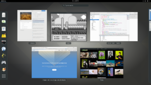
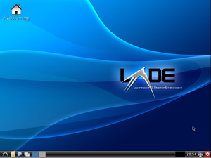
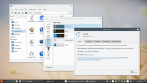
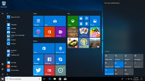
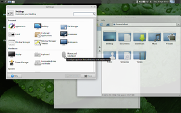

# Detect Desktop Environment

This crate helps you to detect the current desktop environment.
It was inspired by the [`detectDE`](https://cgit.freedesktop.org/xdg/xdg-utils/tree/scripts/xdg-utils-common.in?h=fa5805559ad27382ef62110cb23e67d6eb649030#n270)
function from _xdg-util_.

This library is stable. If you have an issue or want to add a desktop environment, open
a Github issue or send a PR.
Please also report possible naming issues.

## Usage

```rust
extern crate detect_desktop_environment;

use detect_desktop_environment::DesktopEnvironment;

fn main() {
    match DesktopEnvironment::detect() {
        Some(de) => println!("detected desktop environment: {de:?}"),
        None => println!("failed to detect desktop environment"),
    }
}
```

This library exposes two symbols: the `detect` function and it returns value: the
`DesktopValue` enum. All the variants are listed below in the "Supported environments"
section.

## Supported environments

| Name            | Thumbnail                                        |
|-----------------|--------------------------------------------------|
| `Cinnamon`      |            |
| `Enlightenment` |  |
| `Gnome`         |                  |
| `Kde`           |                      |
| `Lxde`          |                    |
| `Lxqt`          |                    |
| `MacOs`         |                 |
| `Mate`          |                    |
| `Unity`         |                  |
| `Windows`       |              |
| `Xfce`          |                    |
